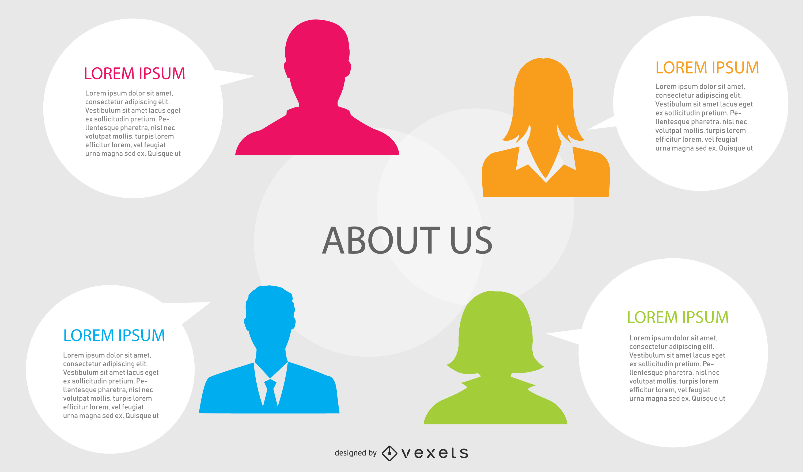

# Raj E-Commerce Website

A responsive **e-commerce frontend website** built with HTML and CSS.  
This project includes a homepage, shop page, product details page, shopping cart, about page, and contact page — styled consistently with a modern UI design.

---

## 📂 Project Structure

├── index.html # Homepage
├── shop.html # Shop listing page
├── singleproduct.html # Single product details page
├── cart.html # Shopping cart page
├── about.html # About us page
├── contact.html # Contact page with map & form
├── style.css # Global stylesheet
└── img/ # Images (logo, products, banners, etc.)

---

## ✨ Features

- **Homepage (`index.html`)**
  - Hero banner with promotional offers
  - Featured products (Sale & New Products)
  - Service highlights (Free Shipping, Promotions, Support, etc.)
  - Newsletter subscription section
  - Footer with contact info & social links

- **Shop Page (`shop.html`)**
  - Displays all available products
  - Click on a product to view details
  - Product ratings and prices
  - “Add to Cart” option

- **Single Product Page (`singleproduct.html`)**
  - Product image gallery
  - Select size and quantity
  - Add to cart functionality
  - Related new product recommendations

- **Cart Page (`cart.html`)**
  - Cart items table with image, price, quantity, subtotal
  - Coupon code input
  - Cart totals with checkout button

- **About Page (`about.html`)**
  - Company introduction (“Who We Are” section)
  - Features (Free Shipping, Save Money, etc.)
  - Newsletter signup

- **Contact Page (`contact.html`)**
  - Company address, email, phone
  - Google Maps embed of office location
  - Contact form (name, email, subject, message)
  - Developer details

- **Global Styling (`style.css`)**
  - Responsive design using Flexbox
  - Reusable UI components (buttons, banners, product cards)
  - Custom color scheme & typography
  - Header & footer styles

---

## 🚀 Getting Started

1. Clone or download this repository.
2. Ensure all files are in the same directory (HTML, CSS, `img` folder).
3. Open `index.html` in your browser.

---

## 📸 Screenshots

- **Homepage**
  

- **Shop Page**
  

- **About Page**
  

---

## 🔧 Technologies Used

- **HTML5** – Structure and content  
- **CSS3** – Styling and layout  
- **Font Awesome** – Icons  

---

## 📌 Future Enhancements

- Add **JavaScript** for cart functionality, filtering, and sorting.  
- Connect to a **backend (Node.js / PHP / Firebase / etc.)** for dynamic product management.  
- Implement **user authentication** (login/register).  
- Add **payment gateway integration**.

---

## 👨‍💻 Author

Developed by **Raj**  
📧 Email: rajv69023@gmail.com  
📞 Phone: +91 8607996993  

---

## 📜 License

This project is open-source and free to use.
